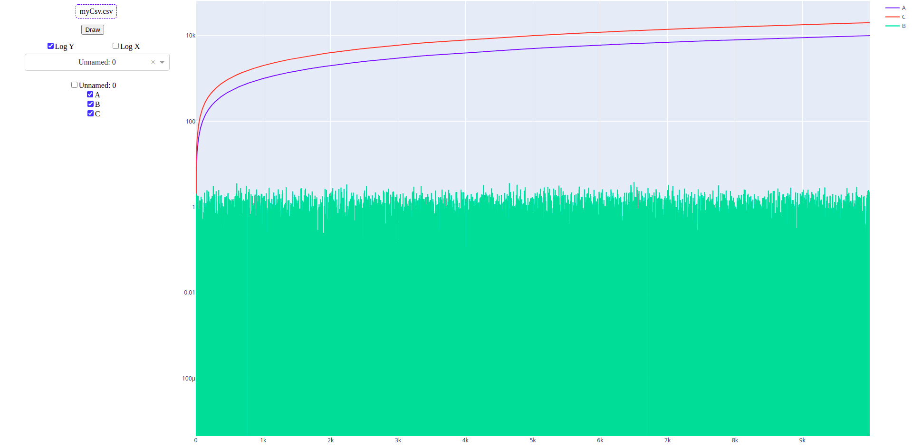

# Data Viz

### Quickly plot multiple line graphs from a pandas readable file

Usage: `python main.py` and the go to the provided `localhost` link.

Required libraries:
    * `dash`
    * `dash_core_components`
    * `pandas`
    * `plotly`

